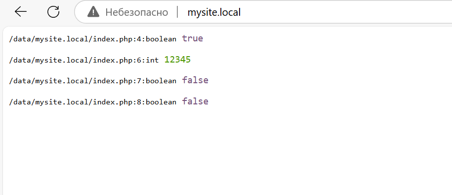
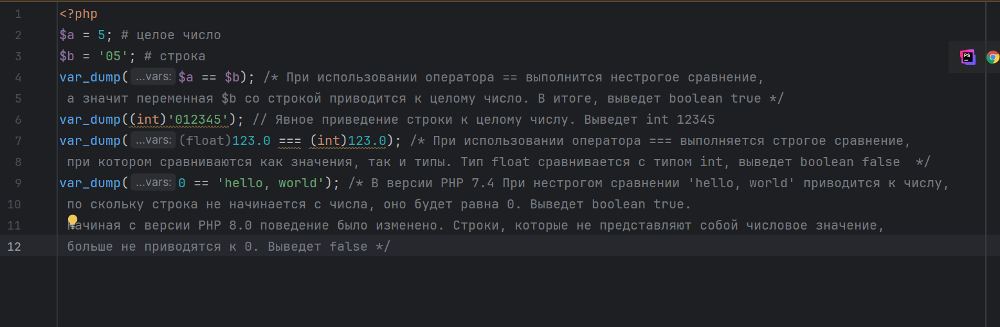
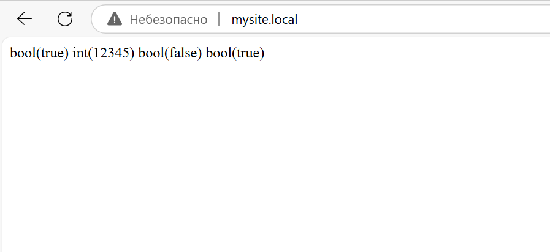

# Домашняя работа
## Задание 1
`Собрать для себя окружение из Nginx + PHP-FPM и PHP CLI`



## Задание 2
`Выполните код в контейнере PHP CLI и объясните, что выведет данный код и почему:`

```
<?php
$a = 5;
$b = '05';
var_dump($a == $b);
var_dump((int)'012345');
var_dump((float)123.0 === (int)123.0);
var_dump(0 == 'hello, world');
?>
```


## Задание 3
`В контейнере с PHP CLI поменяйте версию PHP с 8.2 на 7.4. Изменится ли вывод?`



## Задание 4
`Используя только две числовые переменные, поменяйте их значение местами. Например, если a = 1, b = 2, надо, чтобы получилось: b = 1, a = 2. Дополнительные переменные, функции и конструкции типа list() использовать нельзя.`
```
$a = 1;
$b = 2;

$a = $a + $b; // a теперь 3 
$b = $a - $b; // b теперь 1 
$a = $a - $b; // a теперь 2 

echo "a = $a, b = $b"; // a = 2, b = 1
```